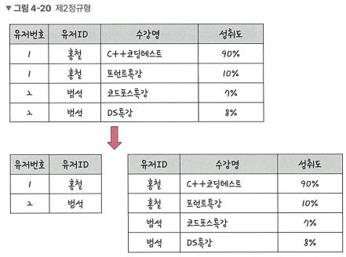
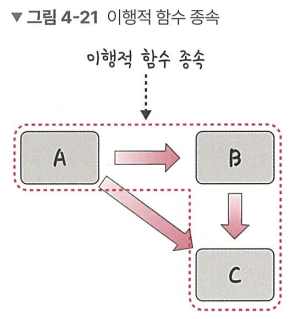
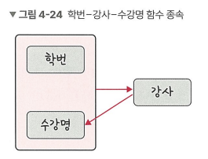
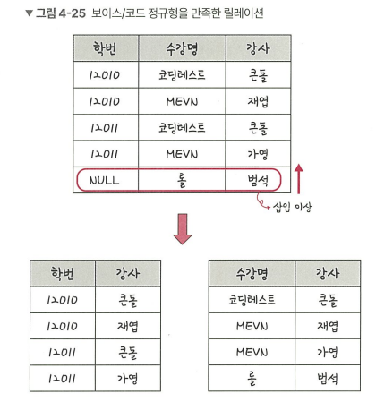

# ERD

## ERD, Entity Relation Diagram

ER 다이어그램

- 데이터베이스를 구축할 때 가장 기초적인 뼈대 역할
- 릴레이션 간의 관계를 정의한 것

## 중요성

- 시스템 요구사항을 기반으로 작성됨
- ERD를 기반으로 데이터베이스 구축
- 이후에도 디버깅/비즈니스 프로세스 재설계 필요 시 설계도 역할을 하기도 함
- 비정형 데이터를 충분히 표현할 수 없다는 단점

비정형 데이터

- 비구조화 데이터
- 미리 정의된 데이터 모델이 없거나, 미리 정의된 방식으로 정리되지 않은 정보

# 정규화, Normal Form

## 정규화란?

잘못된 종속 관계로 인한 [DB 이상 현상](#데이터베이스-이상-현상)을 해결하기 위해서, 혹은 저장 공간을 효율적으로 활용하기 위해 릴레이션을 여러 개로 분리하는 과정.

중복을 최소화하고, 삽입/삭제/수정 이상을 최소화하기 위해, 함수적 종속성과 기본키를 기반으로, 주어진 릴레이션 스키마를 분석하는 과정 - from. 데이터베이스 시스템

데이터베이스 이상 현상

회원이 한 개의 등급을 가져야 하는데 여러 등급을 가지거나, 삭제 시 필요한 데이터가 같이 삭제되거나, 데이터 삽입 시 NULL값을 허용하지 않아 삽입이 어려운 경우 등등.

- 삽입 이상
- 삭제 이상
- 갱신 이상

## 정규화 과정, Normalization

- 정규화 원칙을 기반으로 정규형을 만들어가는 과정
- 정규화된 정도는 정규형(NF, Normal Form)으로 표현

### 종류
- 제1정규형
- 제2정규형
- 제3정규형
- 보이스/코드 정규형(BCNF)
- 제4정규형
- 제5정규형

여기서는 1정규형부터 보이스/코드 정규형까지 확인한다.

실제 데이터베이스 서비스에서도 제3정규형/BCNF까지만 사용하고 있으며, 가끔씩 제4정규형까지 고려하고 있다. - from. 데이터베이스 시스템, 412p

## 정규형 원칙

더 좋은 구조로 만들어야 하고, 자료의 중복성은 감소해야 하고, 독립적인 관계는 별개의 릴레이션으로 표현해야 하며, 각각의 릴레이션은 독립적인 표현이 가능해야 하는 것

## 제1정규형, 1NF: First Normal Form

- 릴레이션의 모든 도메인이, 더 이상 분해될 수 없는 원자값(atomic value)만으로 구성되어야 한다
- 1개의 기본키에 대해 2개 이상의 값을 가지는 반복 집합이 있으면 안 됨

위 {C++코딩테스트, 프론트특강}과 같은 중복된 집합을 분리해서 나열하는 것으로 제1정규형을 만족시켰음.

## 제2정규형, 2NF: Second Normal Form

- 릴레이션이 제1정규형을 만족
- 부분 함수의 종속성을 제거한 형태

부분 함수의 종속석 제거란, 기본키가 아닌 모든 속성이 기본키에 완전 함수 종속적인 것을 말한다

모든 비주요 속성들이, 기본키에 대해 완전히 함수적으로 종속하면 제2정규형이라고 한다. - from. 데이터베이스 시스템

쉽게 이야기하면, 기본키의 부분집합에 종속하면 안 된다.

### 함수적 종속성의 정의

- 속성들의 두 집합 사이의 제약 조건

어떤 속성 X와 Y가 있고, 어떤 X의 값에 대해 Y의 값이 유일하게 정해질 때, X에 대해 Y가 종속적이라고 한다. 이는 X->Y로 표기한다.

<table>
<tr><th>A</th><th>B</th></tr>
<tr><td>a</td><td>b</td></tr>
<tr><td>a</td><td>c</td></tr>
</table>

위 테이블을 예로 든다. A의 값이 a일 때, B가 b와 c가 존재하므로 A의 값에 대해 B의 값이 유일하지 못하다. 그러므로 A에 대해 B가 종속적이지 않다.  
다만, B의 값에 대해서는 A의 값이 모두 유일하므로 B에 대해 A가 종속적이다.

### 함수적 완전 종속성의 정의

X가 속성의 집합일 때, X 내 속성 a를 제외하였음에도 Y의 종속성이 유지된다면, X->Y를 부분 종속성이라고 한다.

<table>
<tr><th>A</th><th>B</th><th>C</th></tr>
<tr><td>a</td><td>b</td><td>d</td></tr>
<tr><td>a</td><td>c</td><td>d</td></tr>
</table>

A,B가 X이고, C가 Y라고 한다. 이 때, X에서 A가 빠진 집합 X'에 대해 Y의 종속성이 유지되고 있으므로, X->Y를 부분 종속성이라고 한다.

종속성을 유지하는 선에서, X에서 더 이상 제거할 속성이 없다면 그 X에 대해선 Y가 완전히 종속적이라고 할 수 있다.

결론적으로, 제2정규형을 만족하려면 기본키에 대해 나머지 속성들이 __완전히 함수적으로__ 종속하여야 한다!  

기본키 유저ID에 완전 종속적인 유저번호를 분리한 모습.  
분리된 각 테이블이 이제 기본키 {유저 ID}와 {유저ID,수강명}에 완전 종속적인 모습을 보인다.

## 제3정규형, 3NF: Third Normal Form
- 제2정규형 만족
- 기본키가 아닌 모든 속성이 이행적 함수 종속을 만족하지 않음

쉽게 이야기하면, 기본키가 아닌 속성에 종속하는 경우가 있으면 안 된다.

### 이행적 함수 종속

A->B와 B->C가 존재하면 논리적으로 A->C도 성립하는데, 이 때 집합 C가 집합 A에 대해 이행 종속적이라고 한다

유저ID->등급, 등급->할인율로 분리한 것을 확인할 수 있다.

## 일반적인 정의에 대해서

지금까지 이야기했던 정의들은 테이블의 다른 후보키들을 전혀 고려하지 않은 정의이다. 그래서 이 문제를 해결하기 위해 각 정규형을 해치지 않는 *더 일반적인 정의*를 마련하였으며, 그 일반적인 정의 중 제3정규형의 정의가 위의 1, 2번 정의이다.

각 정규형의 일반적인 정의는 아래와 같다.

### 제1정규형
제1정규형은 키와 함수적 종속성에 대해 무관하므로, 기존의 정의를 따르면 된다.

### 제2정규형
제 2 정규형은 아래와 같은 일반적 정의를 갖는다:

- 모든 비주요 속성 A가, 그 어떤 키에도 부분적으로 속하지 않는다면, R은 제2정규형이다.
    - 즉, 속성 A가, 모든 키에 완전히 함수적으로 종속하면, 제2정규형이다.

"키"에 대해

유일성과 최소성을 만족하는 속성 집합을 "키"라고 하며, 이 키가 2개 이상이 되면 기본키와 후보키로 다시 나누어 부른다.(적어도 데이터베이스 시스템 7판에선 그렇게 정의하고 설명하고 있음)  
데이터베이스 시스템 7판, 413p

위 조건대로라면, 이행적으로 종속하더라도, 모든 키에 완전히 종속적이기만 하다면 제2정규형을 만족하게 된다.

### 제3정규형
- 스키마 R의 모든 함수적 종속성 X->A에 대해, X가 R의 슈퍼키이거나, A가 R의 주요 속성이라면, R은 제3정규형을 만족한다.  

위 정의대로라면, 이행적 종속성을 이룰 수가 없으므로 제3정규형을 만족할 수 있다.

### BCNF
- 스키마 R의 모든 함수적 종속성 X->A에 대해, X가 R의 슈퍼키라면, R은 BCNF를 만족한다.  

위의 제3정규형에서 2번째 조건이 사라진 형태이다. 위 과정을 만족시키는 과정에서 종속성의 손실이 일어날 수 있다.

자세한 내용은 아래에서 다룬다.

## 보이스/코드 정규형, BCNF: Boyce-Codd Normal Form

BCNF의 정의는 *일반적인 정의*를 따른다.

- 제3정규형 만족
- 결정자가 후보키가 아닌 함수 종속 관계 제거
    - 모든 결정자가 후보키가 되도록 만듦

X->Y일 때, X를 결정자, Y를 종속자라고 한다.

제3정규형보다 조금 더 엄격한 정규형이다.

제3정규형보다 조금 더 엄격한 정규형

{A,B}가 기본키이고, {A,B}->C이면서 C->B일 때, C->B 종속성을 분리해주어야 함!

그러면 A->C와 C->B를 만족하는 두 테이블로 분리가 된다.

위 설명은 아래와 같다!

아래 테이블에서 강사 속성의 값을 보면 강사가 키가 되지 못한다는 것을 알 수 있다.  
'큰돌' 값이 중복되므로 키가 되지 못한다.  
그래서 후보키가 아닌 종속 관계가 되므로 이를 분리해주어야 한다.

### 제3정규형과 BCNF에 대해

제3정규형의 *일반적인 정의*를 다시 살펴본다. 이는 아래와 같다:

스키마 R의 모든 함수적 종속성 X->A에 대해,  

1. X가 R의 슈퍼키이거나,
2. A가 R의 주요 속성이라면,

R은 제3정규형을 만족한다.

주요 속성

임의의 후보키에 속하고 있는 속성들을 가리킴. 
그렇지 않은 속성들은 비주요 속성이라고 함. 
- 데이터베이스 시스템 7판, 413p

<table>
<tr><th>__A__</th><th>B</th><th>C</th><th>D</th></tr>
</table>

__a__로 표시한 것은 기본키임을 가리킨다.

위와 같은 스키마 R이 존재한다고 가정하자.  
그리고 A가 기본키이고, {B,C}가 후보키이고,  
종속성 A->{B,C,D}와 {B,C}->{A,D}를 만족한다고 하자.

이 때, R은 제3정규형과 BCNF를 만족하고 있다.

**여기에, 종속성 D->C가 생긴다고 가정해본다.**

위에서 언급한 제3정규형의 일반적 정의의 2번에 따르면, C가 주요 속성 중 하나이므로, 제3정규형을 만족한다. 그러나 BCNF를 만족하지 못한다. BCNF는 제3정규형의 일반적인 정의 중 2번을 허용하지 않기 때문이다.(결정자가 후보키가 아니면 안 되므로.)

위 문제를 해결하기 위해 D->C 종속성을 다른 테이블로 분리하여야 하며, 이 과정에서 <u>{B,C}->{A,D} 종속성을 잃기도 한다.</u> 테이블은 아래와 같이 나뉘게 된다.

<table>
<tr><th>__A__</th><th>B</th><th>D</th></tr>
</table>

<table>
<tr><th>C</th><th>__D__</th></tr>
</table>

\-

위에서 언급했던 학번, 수강명, 강사 테이블에 대해 다시 다루어보자.  
쉬운 설명을 위해, 학번, 수강명, 강사 속성을 A,B,C로 나타낸다.

<table>
<tr><th>__A__</th><th>__B__</th><th>C</th></tr>
</table>

{A,B}->C, C->B

여기서 C->B의 존재로, 제3정규형은 만족하지만 BCNF가 아니게 된다.  
그래서 아래와 같이 테이블을 나누게 된다.

<table>
<tr><th>__A__</th><th>__C__</th></tr>
</table>

<table>
<tr><th>B</th><th>__C__</th></tr>
</table>

이 과정에서 종속성 {A,B}->C를 잃게 된다.

### BCNF의 분리 과정

> tl;dr: BCNF 위반하는 종속성만 테이블로 분리하면 된다.

BCNF를 분리할 때, 분리할 수 있는 가짓수가 여러 가지이다. 이 때, 가장 바람직하게 분리된 테이블이 무엇인지 고르는 방법을 알아본다.

위에서 언급했던 학번, 수강명, 강사 테이블에 대해 한번 더 다루어본다.

<table>
<tr><th>__A__</th><th>__B__</th><th>C</th></tr>
</table>

{A,B}->C, C->B

위 테이블을, BCNF를 만족하는 테이블로 분리하는 방법은 총 세가지이다.

<table style="margin-right: 20px">
<tr><th>__A__</th><th>__B__</th></tr>
</table>

<table>
<tr><th>__A__</th><th>__C__</th></tr>
</table>

<table style="margin-right: 20px">
<tr><th>__A__</th><th>__B__</th></tr>
</table>

<table>
<tr><th>B</th><th>__C__</th></tr>
</table>

<table style="margin-right: 20px">
<tr><th>__A__</th><th>__C__</th></tr>
</table>

<table>
<tr><th>B</th><th>__C__</th></tr>
</table>

정규화의 목적은 `무손실 조인`과 `함수의 종속성 보존`에 있다.  
BCNF는 함수의 종속성 보존을 이루지는 못하나, 무손실 조인을 만족시켜야 하므로, 이를 만족하는 테이블을 선택하면 된다.

NJB(Nonaddictive Join Test for Binary Decompositions)를 통해, 이를 만족하는지 검사할 수 있다.

스키마 R이 아래 내용을 만족하면 무손실/비부가적 조인 특성을 가지며, 이 검사를 NJB라고 한다.

> R의 모든 함수적 종속성 $F^+$에 대해, $F^+$가 $(R_1 \cap R_2) \rightarrow (R_1 - R_2)$ 와 $(R_1 \cap R_2) \rightarrow (R_2 - R_1)$ 중 하나를 포함한다

\-

// DCNF 만드는 알고리즘 설명하기

1. R에 BCNF을 위반하는 X->A가 있다면, R을 R-A, XA로 나눈다.
2. 각 스키마가 여전히 DCNF를 지키지 않는다면, 위 작업을 재귀적으로 반복한다.

## 비정규화, Denormalization

정규화를 통해 테이블을 나누면 연산 시간이 지나치게 길어지기도 한다. 특히 조인 연산 과정에서 시간이 오래 걸린다.

이상 현상을 감수하더라도, 성능 향상을 위해 정규형을 깨뜨리고 테이블을 합치는 것을 비정규화라고 한다.

BCNF에서 일어나는 종속성의 손실을 회피하고자 제3정규형까지만 유지하는 것도 일종의 비정규화라 할 수 있겠다.

---
## 추가 참고자료

- 데이터베이스 시스템 7판 - Elmasri & navathe
    - 함수적 종속성의 정의 - 408p
- [블로그 - 정규화 & 함수 종속성](https://rebro.kr/159)
- [블로그 - 정규형](https://rebro.kr/160)
- [블로그 - 번역본에서 잘 설명되지 않은 NJB 부분 보충](https://velog.io/@bsu1209/DB-Basics-of-Functional-Dependencies-and-Normalization-for-Relational-Databases#njb-nonaddictive-join-test-for-binary-decompostions)