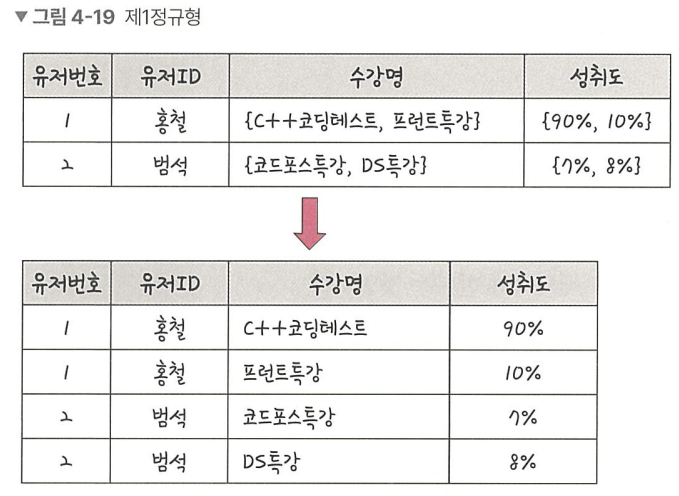
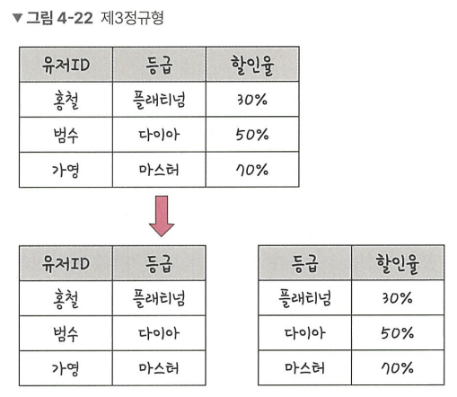

# ERD

## ERD, Entity Relation Diagram

ER 다이어그램

- 데이터베이스를 구축할 때 가장 기초적인 뼈대 역할
- 릴레이션 간의 관계를 정의한 것

## 중요성

- 시스템 요구사항을 기반으로 작성됨
- ERD를 기반으로 데이터베이스 구축
- 이후에도 디버깅/비즈니스 프로세스 재설계 필요 시 설계도 역할을 하기도 함
- [비정형 데이터](#비정형-데이터)를 충분히 표현할 수 없다는 단점

### 비정형 데이터

- 비구조화 데이터
- 미리 정의된 데이터 모델이 없거나, 미리 정의된 방식으로 정리되지 않은 정보

# 정규화, Normal Form

## 정규화란?

잘못된 종속 관계로 인한 [DB 이상 현상](#데이터베이스-이상-현상)을 해결하기 위해서, 혹은 저장 공간을 효율적으로 활용하기 위해 릴레이션을 여러 개로 분리하는 과정.

중복을 최소화하고, 삽입/삭제/수정 이상을 최소화하기 위해, 함수적 종속성과 기본키를 기반으로, 주어진 릴레이션 스키마를 분석하는 과정 - from. 데이터베이스 시스템

### 데이터베이스 이상 현상

회원이 한 개의 등급을 가져야 하는데 여러 등급을 가지거나, 삭제 시 필요한 데이터가 같이 삭제되거나, 데이터 삽입 시 NULL값을 허용하지 않아 삽입이 어려운 경우 등등.

## 정규화 과정, Normalization

- 정규화 원칙을 기반으로 정규형을 만들어가는 과정
- 정규화된 정도는 정규형(NF, Normal Form)으로 표현

### 종류
- 제1정규형
- 제2정규형
- 제3정규형
- 보이스/코드 정규형(BCNF)
- 제4정규형
- 제5정규형

여기서는 1정규형부터 보이스/코드 정규형까지 확인한다.

실제 데이터베이스 서비스에서도 제3정규형/BCNF까지만 사용하고 있으며, 가끔씩 제4정규형까지 고려하고 있다. - from. 데이터베이스 시스템, 412p

## 정규형 원칙

더 좋은 구조로 만들어야 하고, 자료의 중복성은 감소해야 하고, 독립적인 관계는 별개의 릴레이션으로 표현해야 하며, 각각의 릴레이션은 독립적인 표현이 가능해야 하는 것

## 제1정규형, 1NF: First Normal Form

- 릴레이션의 모든 도메인이, 더 이상 분해될 수 없는 원자값(atomic value)만으로 구성되어야 한다
- 1개의 기본키에 대해 2개 이상의 값을 가지는 반복 집합이 있으면 안 됨

위 {C++코딩테스트, 프론트특강}과 같은 중복된 집합을 분리해서 나열하는 것으로 제1정규형을 만족시켰음.

## 제2정규형, 2NF: Second Normal Form

- 릴레이션이 제1정규형을 만족
- 부분 함수의 종속성을 제거한 형태

부분 함수의 종속석 제거란, 기본키가 아닌 모든 속성이 기본키에 완전 함수 종속적인 것을 말한다

모든 비주요 속성들이, 기본키에 대해 완전히 함수적으로 종속하면 제2정규형이라고 한다. - from. 데이터베이스 시스템

쉽게 이야기하면, 기본키의 부분집합에 종속하면 안 된다.

### 함수적 종속성의 정의

- 속성들의 두 집합 사이의 제약 조건

어떤 속성 X와 Y가 있고, 어떤 X의 값에 대해 Y의 값이 유일하게 정해질 때, X에 대해 Y가 종속적이라고 한다. 이는 X->Y로 표기한다.

<table>
<tr><th>A</th><th>B</th></tr>
<tr><td>a</td><td>b</td></tr>
<tr><td>a</td><td>c</td></tr>
</table>

위 테이블을 예로 든다. A의 값이 a일 때, B가 b와 c가 존재하므로 A의 값에 대해 B의 값이 유일하지 못하다. 그러므로 A에 대해 B가 종속적이지 않다.  
다만, B의 값에 대해서는 A의 값이 모두 유일하므로 B에 대해 A가 종속적이다.

### 함수적 완전 종속성의 정의

X가 속성의 집합일 때, X 내 속성 a를 제외하였음에도 Y의 종속성이 유지된다면, X->Y를 부분 종속성이라고 한다.

<table>
<tr><th>A</th><th>B</th><th>C</th></tr>
<tr><td>a</td><td>b</td><td>d</td></tr>
<tr><td>a</td><td>c</td><td>d</td></tr>
</table>

A,B가 X이고, C가 Y라고 한다. 이 때, X에서 A가 빠진 집합 X'에 대해 Y의 종속성이 유지되고 있으므로, X->Y를 부분 종속성이라고 한다.

종속성을 유지하는 선에서, X에서 더 이상 제거할 속성이 없다면 그 X에 대해선 Y과 완전 종속적이라고 할 수 있다.

결론적으로, 제2정규형을 만족하려면 기본키에 대해 나머지 속성들이 __완전히 함수적으로__ 종속하여야 한다!  

책에서는 위 테이블의 기본키가 {유저번호,유저ID}라고 하는데, 그러면 유일성을 만족하지 못한다.  
아래 설명에서는 {유저ID,수강명}을 기본키로 한다.

기본키 {유저ID,수강명}가 아닌, 유저ID에 완전 종속적인 유저번호를 분리한 모습.  
우측 테이블은 기본키 {유저ID,수강명}에 완정 종속적인 모습을 보인다.

좋은 예시는 아닌 것 같다. 정말로.

## 제3정규형, 3NF: Third Normal Form
- 제2정규형 만족
- 기본키가 아닌 모든 속성이 이행적 함수 종속을 만족하지 않음

쉽게 이야기하면, 기본키가 아닌 속성에 종속하는 경우가 있으면 안 된다.

### 이행적 함수 종속

A->B와 B->C가 존재하면 논리적으로 A->C도 성립하는데, 이 때 집합 C가 집합 A에 대해 이행 종속적이라고 한다

유저ID->등급, 등급->할인율로 분리한 것을 확인할 수 있다.

## 보이스/코드 정규형, BCNF: Boyce-Codd Normal Form
- 제3정규형 만족
- 결정자가 후보키가 아닌 함수 종속 관계 제거
    - 모든 결정자가 후보키가 되도록 만듦

X->Y일 때, X를 결정자, Y를 종속자라고 함

제3정규형보다 조금 더 엄격한 정규형

{A,B}가 기본키이고, {A,B}->C이면서 C->B일 때, (그리고 C가 후보키가 될 수 없을 때)  
C->B 종속성을 분리해주어야 함!

그러면 A->C와 C->B를 만족하는 두 테이블로 분리가 된다.

위 설명은 아래와 같다!

아래 테이블에서 강사 속성의 값을 보면 강사가 키가 되지 못한다는 것을 알 수 있다.  
'큰돌' 값이 중복되므로 키가 되지 못한다.  
그래서 후보키가 아닌 종속 관계가 되므로 이를 분리해주어야 한다.

---
## 추가 참고자료

- 데이터베이스 시스템 7판 - Elmasri & navathe
    - 함수적 종속성의 정의 - 408p
- [블로그 - 정규화 & 함수 종속성](https://rebro.kr/159)
- [블로그 - 정규형](https://rebro.kr/160)
